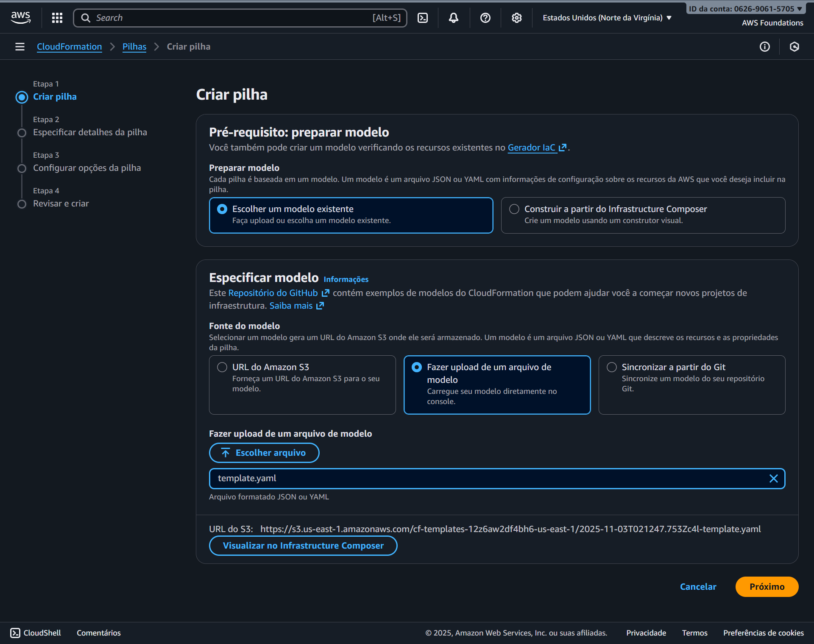
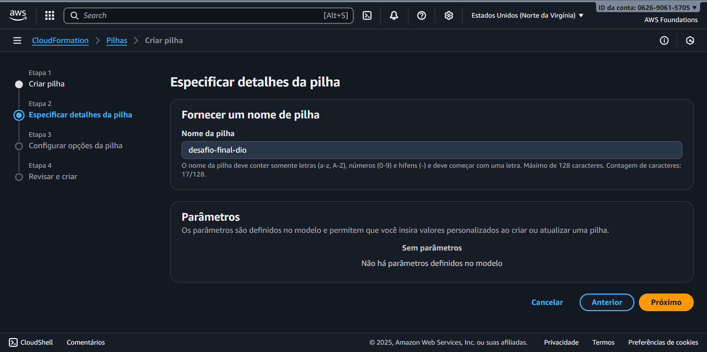
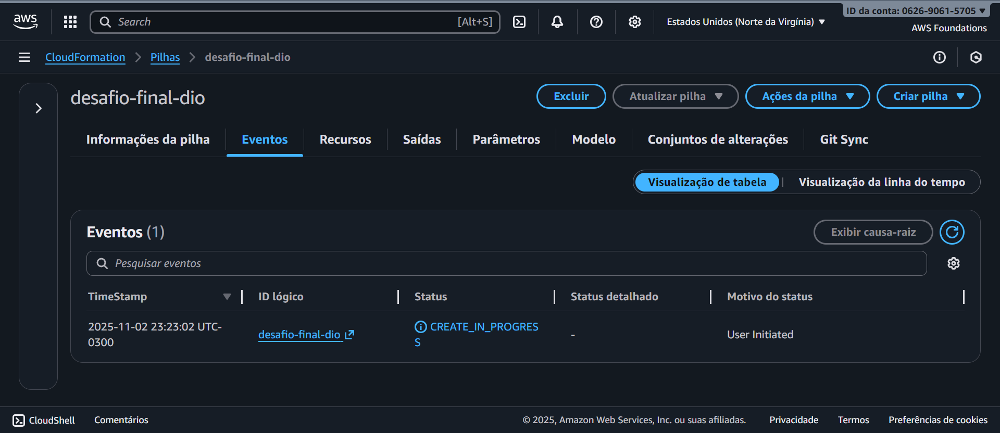
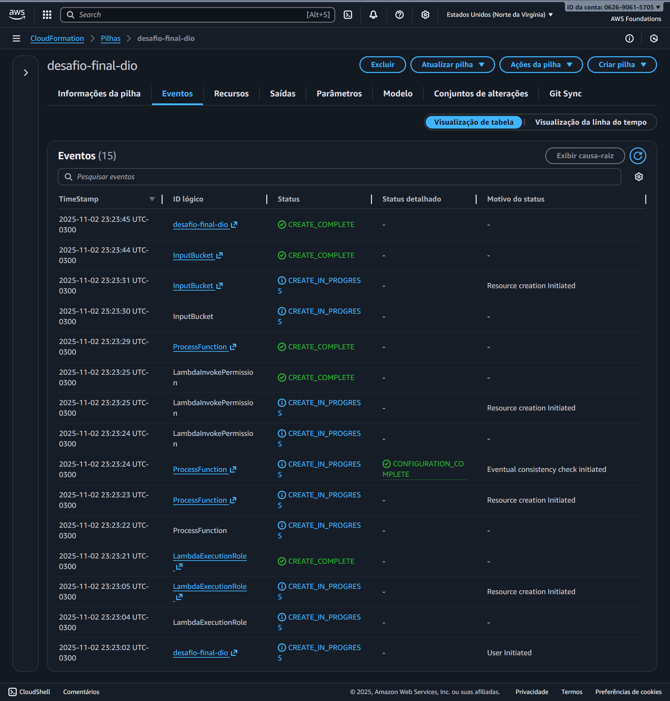

# ☁️ Desafio Final – AWS CloudFormation, S3 e Lambda

## 📘 Visão Geral

Projeto desenvolvido como parte da formação **AWS Cloud Foundations – DIO & Santander Code Girls**.  
Este desafio teve como objetivo aplicar os conceitos de **Infraestrutura como Código (IaC)**, utilizando o **AWS CloudFormation** para criar uma arquitetura automatizada integrando **Amazon S3**, **AWS Lambda** e **Amazon CloudWatch Logs**.

O modelo em **YAML** cria automaticamente todos os recursos necessários e demonstra a automação completa do fluxo **serverless** de processamento de arquivos.

---

## 🧠 Conceitos Aplicados

- **Infraestrutura como Código (IaC)** com CloudFormation  
- **Automação serverless** com AWS Lambda  
- **Armazenamento de objetos** com Amazon S3  
- **Monitoramento e auditoria** com CloudWatch Logs  
- **Permissões seguras** via IAM Role  

---

## 🧩 Estrutura do Projeto

```
📁 desafio-aws-cloudformation-lambda-s3/
│
├── 📄 README.md
├── 📄 template.yaml
├── 📁 images/
│ ├── 01-cloudformation-upload-template.png
│ ├── 02-cloudformation-nome-da-pilha.png
│ ├── 03-cloudformation-criacao-em-andamento.png
│ ├── 04-cloudformation-stack-completa.png
│ └── arquitetura-s3-lambda.png
└── 📁 anotacoes/
├── cloudformation.md
├── lambda-s3.md
└── insights.md
```


---

## ⚙️ Arquitetura da Solução

A stack criada pelo CloudFormation configura automaticamente:

| Recurso | Descrição |
|----------|------------|
| **Amazon S3 (Input)** | Armazena arquivos enviados pelo usuário. |
| **AWS Lambda (ProcessFunction)** | Executa automaticamente quando novos objetos são criados no S3. |
| **IAM Role** | Permite que a Lambda acesse o S3 e grave logs. |
| **CloudWatch Logs** | Registra logs de execução da função Lambda. |

---

## 🗺️ Diagrama da Arquitetura


---

## 🧪 Fluxo de Funcionamento

1️⃣ O **usuário** realiza upload de um arquivo no **bucket S3 (Input)**.  
2️⃣ O evento **s3:ObjectCreated** aciona automaticamente a **função Lambda (ProcessFunction)**.  
3️⃣ A **Lambda** processa o evento e executa o código definido no `template.yaml`.  
4️⃣ A execução é registrada no **Amazon CloudWatch Logs**.  

---

## 🧾 Trecho do Template CloudFormation (YAML)

```yaml
Resources:
  LambdaExecutionRole:
    Type: AWS::IAM::Role
    Properties:
      AssumeRolePolicyDocument:
        Version: "2012-10-17"
        Statement:
          - Effect: Allow
            Principal: { Service: lambda.amazonaws.com }
            Action: sts:AssumeRole
      ManagedPolicyArns:
        - arn:aws:iam::aws:policy/service-role/AWSLambdaBasicExecutionRole
        - arn:aws:iam::aws:policy/AmazonS3FullAccess

  ProcessFunction:
    Type: AWS::Lambda::Function
    Properties:
      Runtime: python3.11
      Handler: index.handler
      Role: !GetAtt LambdaExecutionRole.Arn
      Code:
        ZipFile: |
          import json
          def handler(event, context):
              print("Evento S3 recebido:", json.dumps(event))
              return {"status": "ok"}

  LambdaInvokePermission:
    Type: AWS::Lambda::Permission
    Properties:
      Action: lambda:InvokeFunction
      FunctionName: !Ref ProcessFunction
      Principal: s3.amazonaws.com

  InputBucket:
    Type: AWS::S3::Bucket
    DependsOn: LambdaInvokePermission
    Properties:
      VersioningConfiguration:
        Status: Enabled
      NotificationConfiguration:
        LambdaConfigurations:
          - Event: "s3:ObjectCreated:*"
            Function: !GetAtt ProcessFunction.Arn
```

## 🧮 Benefícios Técnicos

| Recurso | Benefício |
|----------|------------|
| **CloudFormation** | Criação automatizada e reprodutível da infraestrutura. |
| **Lambda** | Execução de código sem necessidade de servidores. |
| **S3** | Armazenamento escalável e seguro de objetos. |
| **CloudWatch Logs** | Monitoramento centralizado e rastreabilidade das execuções. |

---

## 📸 Evidências da Execução

| Etapa | Descrição | Imagem |
|-------|------------|--------|
| 1️⃣ | Upload do modelo `template.yaml` no AWS CloudFormation. |  |
| 2️⃣ | Definição do nome da pilha (`desafio-final-dio`). |  |
| 3️⃣ | Processo de criação em andamento. |  |
| 4️⃣ | Stack criada com sucesso — todos os recursos com status **CREATE_COMPLETE**. |  |
| ☁️ | Arquitetura final implementada (S3 → Lambda → CloudWatch Logs). |  |


---

## 💡 Insights e Aprendizados

- **CloudFormation** elimina configurações manuais e garante padronização entre ambientes.  
- **Eventos S3 → Lambda** permitem construir fluxos automatizados sem infraestrutura física.  
- **CloudWatch Logs** é essencial para auditoria, depuração e observabilidade.  
- O uso de **YAML declarativo** torna o projeto escalável e versionável em repositórios Git.  

---

## 🧾 Conclusão

Este projeto consolidou o domínio prático de **Infraestrutura como Código (IaC)**, **Lambda Functions** e **integração entre serviços AWS**.  
A stack foi implementada com sucesso via **CloudFormation**, demonstrando automação completa de um ambiente **serverless e reprodutível**.

---

## ✨ Autora

**Lorena Cardoso Sanches**  
Formação **AWS Cloud Foundations – DIO & Santander Code Girls**  
📍 São Bernardo do Campo – SP  
🔗 [linkedin.com/in/lorenacardososanches](https://www.linkedin.com/in/lorenacardososanches)
